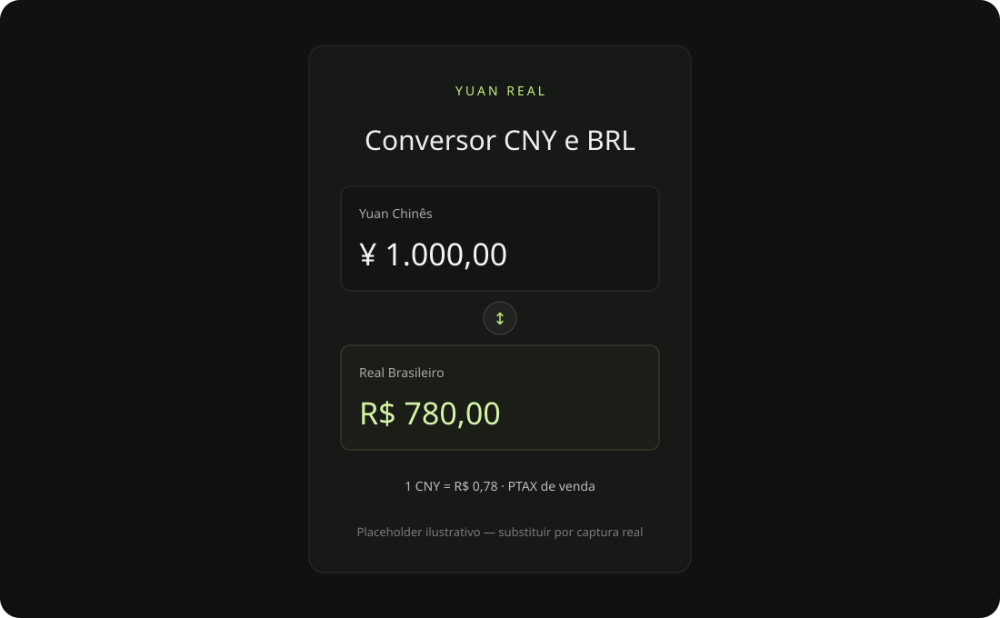

# Yuan Real



Calculadora minimalista para converter Yuan Chinês (CNY) e Real Brasileiro (BRL), feita para uso cotidiano. A aplicação usa a cotação PTAX oficial de venda do Banco Central do Brasil como referência.

## Recursos

- Conversão instantânea nos dois sentidos, com entrada de valores no padrão brasileiro.
- PTAX de venda usada na conversão e PTAX de compra nos detalhes.
- Histórico recente, variações anterior, de 7 dias e de 30 dias, e indicação descritiva da tendência.
- PWA instalável, interface responsiva e cotação salva localmente para consulta offline, identificada como desatualizada.
- Worker faz a consulta à API oficial; o navegador não acessa o Banco Central diretamente.

## Stack

React, TypeScript estrito, Vite, Cloudflare Workers, Cloudflare Vite plugin, PWA com service worker, npm e Vitest. Não há banco de dados, login, secrets ou serviços pagos.

## Rodar localmente

Requer Node.js 20.19+ ou 22.12+ e npm.

```bash
npm install
npm run dev
```

Abra o endereço impresso pelo Vite (normalmente `http://localhost:5173`). O plugin Cloudflare executa o Worker localmente para disponibilizar `/api/rates`.

Verificação e build:

```bash
npm test
npm run build
```

Para inspecionar a versão de produção localmente:

```bash
npm run preview
```

## Fonte oficial e metodologia PTAX

Os dados vêm exclusivamente do Banco Central do Brasil. O recurso PTAX Olinda `Moedas` atualmente não expõe CNY para consultas por `CotacaoMoedaPeriodo`. Para obter a moeda, o Worker usa o [CSV oficial diário de fechamento de todas as moedas](https://www4.bcb.gov.br/Download/fechamento/{YYYYMMDD}.csv), publicado pelo próprio BCB e acessível também pela [consulta de fechamento de todas as moedas](https://ptax.bcb.gov.br/ptax_internet/consultarTodasAsMoedas.do?method=consultaTodasMoedas).

No CSV, a aplicação seleciona exclusivamente a linha CNY com código BCB **795** e tipo **A**; não usa CNH (código **796**). A busca começa na data atual de `America/Sao_Paulo` e recua no máximo dez datas até achar um arquivo válido com CNY. O Worker lê o CSV com suporte a Windows-1252, valida os campos e converte os decimais com vírgula. Finais de semana, feriados e arquivos ainda não publicados são tratados pelo recuo de datas, sem supor que todos os dias de segunda a sexta tenham cotação.

O histórico usa os CSVs diários disponíveis no período recente, até aproximadamente 30 fechamentos. Respostas de `/api/rates` têm cache curto; arquivos de datas passadas, cache mais longo, pois são imutáveis. A conversão em si ocorre localmente no navegador e não faz novas consultas enquanto a pessoa digita.

A conversão usa `cotacaoVenda` e mostra a `cotacaoCompra` na área de detalhes. O gráfico reúne os fechamentos recentes disponíveis; as comparações usam o fechamento anterior e os fechamentos mais próximos das referências de 7 e 30 dias. A tendência é apenas uma descrição do histórico recente.

> A cotação exibida é uma referência PTAX do Banco Central do Brasil e pode diferir das taxas praticadas por bancos, cartões, casas de câmbio e serviços de pagamento.

A PTAX não é uma oferta nem garante o preço de uma operação. O app não prevê preços nem faz recomendações financeiras. O Banco Central pode estar indisponível, e os fechamentos são publicados conforme o calendário de divulgação. Se não for possível atualizar, a aplicação pode exibir a última cotação salva no navegador com o aviso **“Cotação armazenada - pode estar desatualizada”**. Sem cotação salva, conversões dependentes de taxa ficam indisponíveis.

## Deploy Cloudflare

O projeto está preparado como um único Worker com assets estáticos e endpoint `/api/rates`. Nenhum deploy foi executado.

1. Crie ou acesse uma conta gratuita Cloudflare e instale/autentique o Wrangler quando solicitado.
2. Revise `name` e `compatibility_date` em `wrangler.jsonc`, se necessário.
3. Faça o build e publique manualmente com:

```bash
npm run deploy
```

Esse comando publica na Cloudflare. Não é necessário configurar segredo ou banco para este MVP. Consulte os limites atuais do plano Cloudflare antes de uso em escala.

## Estrutura

```text
public/             Ícone da aplicação
src/                Interface, estilos e lógica compartilhada/testes
worker/index.ts     API PTAX e normalização no Cloudflare Worker
index.html          Entrada da aplicação
vite.config.ts      Vite, Cloudflare e PWA
wrangler.jsonc      Configuração do Worker e assets
```

## Licença

[MIT](LICENSE)
