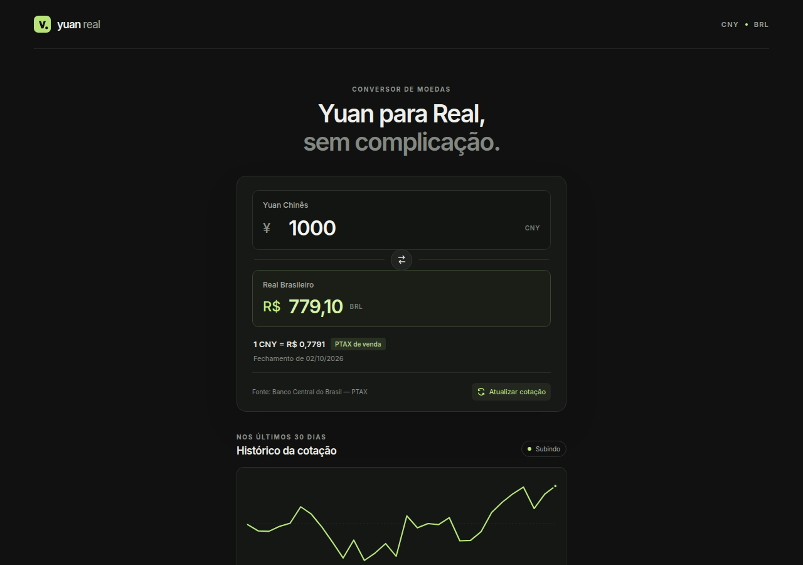

# Yuan Real

Conversor CNY ↔ BRL usando cotações oficiais de fechamento do Banco Central do Brasil.

React · TypeScript · Cloudflare Workers · PWA



## Funcionalidades

- Conversão CNY → BRL e BRL → CNY, com entrada no padrão brasileiro (`1.000,50`).
- Botão para inverter o sentido da conversão.
- Cotação de venda usada no cálculo; compra e venda com quatro casas nos detalhes.
- Data do fechamento utilizado e identificação da fonte (BCB).
- Histórico dos últimos ~30 fechamentos, variação anterior/7 dias/30 dias e tendência descritiva.
- PWA instalável; sem conexão, mostra a última cotação salva no navegador, marcada como possivelmente desatualizada.

## Origem dos dados

> A cotação exibida é uma referência PTAX/fechamento oficial do Banco Central do Brasil e pode diferir das taxas praticadas por bancos, cartões, casas de câmbio e serviços de pagamento.

- A moeda usada é o **CNY**, código BCB **795**, tipo A. O **CNH** (código **796**) não é utilizado.
- O recurso OData `Moedas` da API PTAX (Olinda) não expõe CNY atualmente. Por isso o projeto usa o **CSV oficial diário de fechamento de todas as moedas**, publicado pelo próprio BCB:
  `https://www4.bcb.gov.br/Download/fechamento/{YYYYMMDD}.csv`
- Finais de semana e feriados usam o fechamento anterior disponível.

## Como funciona

O Worker atende `GET /api/rates`: parte da data atual em `America/Sao_Paulo`, recua até 10 dias até achar um CSV com a linha CNY/795/A, e monta o histórico com os CSVs dos ~45 dias anteriores. O CSV é lido em Windows-1252 e os decimais com vírgula são validados.

Cache (Cache API do Cloudflare): resposta de `/api/rates` por 3 minutos, CSV do dia por 3 minutos e CSVs de datas passadas por 30 dias, já que não mudam. A conversão é feita no navegador, sem novas requisições enquanto se digita. O navegador nunca acessa o BCB diretamente.

## Instalação e desenvolvimento

Requer Node.js 20.19+ ou 22.12+.

```bash
npm install
npm run dev       # Vite + Worker local em http://localhost:5173
```

## Testes e build

```bash
npm test          # Vitest
npm run build     # tsc + vite build (cliente + Worker)
npm run preview   # serve o build localmente com o Worker
```

## Deploy

Um único Cloudflare Worker serve os assets estáticos (SPA/PWA) e a API. Não há secrets, banco de dados nem serviços pagos.

```bash
npx wrangler login
npm run deploy    # build + wrangler deploy
```

## Estrutura

```text
src/              Interface React, estilos, lógica de conversão e testes
worker/index.ts   Worker: leitura dos CSVs do BCB, histórico, cache e /api/rates
public/           Ícones da PWA
docs/             Screenshot do README
vite.config.ts    Vite, plugin Cloudflare e PWA
wrangler.jsonc    Configuração do Worker e dos assets
```

## Limitações

- A PTAX é uma referência; não é oferta nem garante o preço de uma operação.
- O fechamento do dia só aparece depois de publicado pelo BCB; até lá é exibido o anterior.
- Se o BCB estiver indisponível e não houver cotação salva no navegador, a conversão fica indisponível.
- O app não faz previsões nem recomendações financeiras.

## Licença

[MIT](LICENSE)
